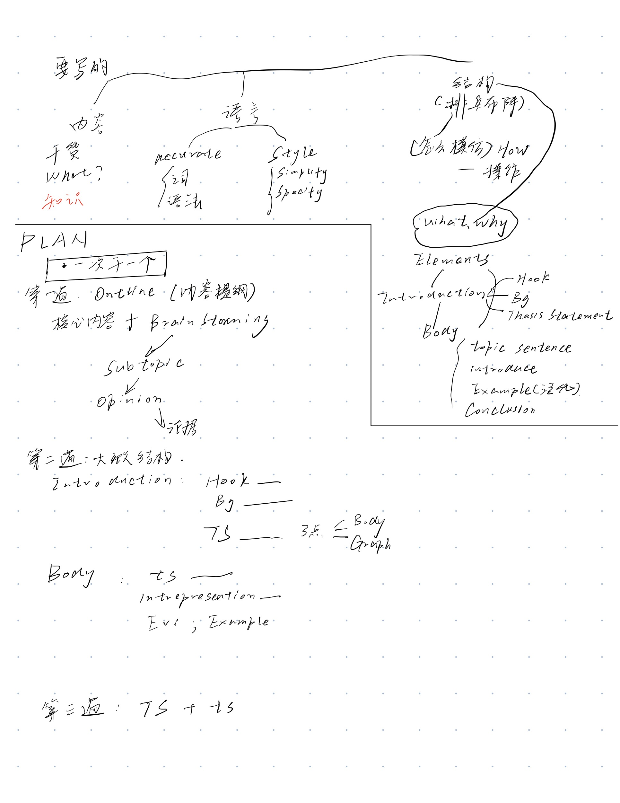
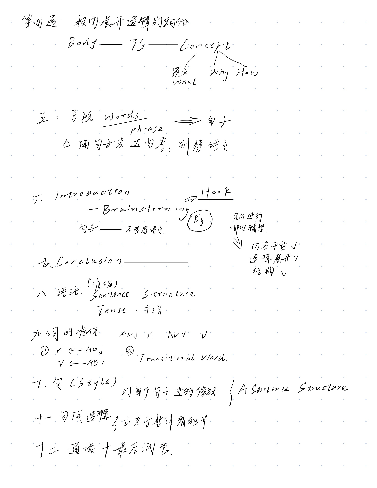

# BaiyundeKe
## First-Round
* **Content**

* Introduction: Reasoning & Critical Thinking
* Deductive Argument & Inductive Argument---推断演绎与归纳演绎
* Writing & Assessing Argumentative Essays
* Strategies for Organizing an Argumentative Essays
* Reconstructing Argument
* Assessing Argument
* Argue Back
* Causal Relationship
* Meaning and definition
* Clarify meaning + 修辞技巧及缪误
* Ethics and law

### 160226ZX [写作课] First class
* Intro
  * Issue 
    * Describe: Identify the argument 1-2 
    * Analysis: Concept Definte 3-4
    * Evaluate: The value of argument 5-6
    * Assessing the contrary position & Argue Back 7-8
  * Making your Argument and Summary  9-10 week

#### Introduction of Argument and Hobbes's Argument
* 画个逻辑链条

* [argument](https://writingcenter.unc.edu/tips-and-tools/argument/)
### 160422ZX [写作课] 写作方法论

