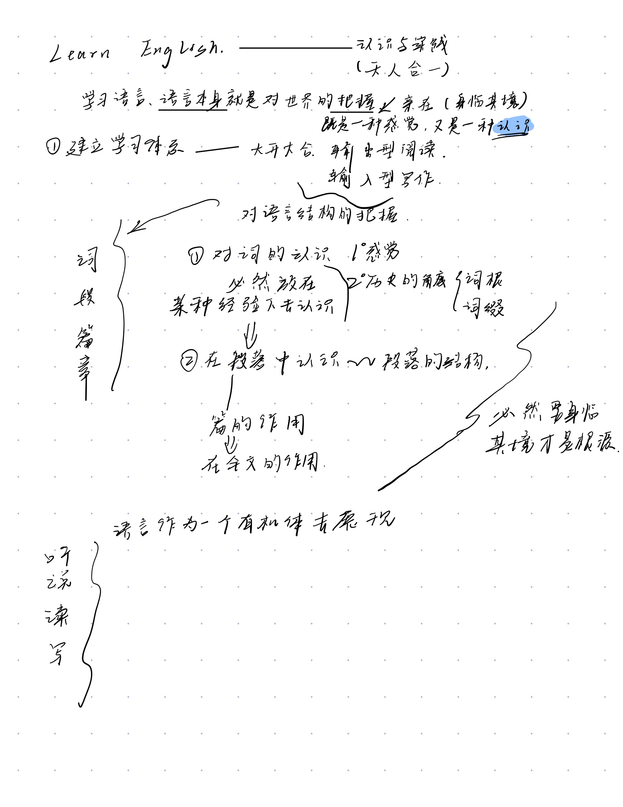

# English_plan
The study of English

[对学习英语的反思与总结](thinking.md)

## [As the thinking of learning English](./Methods.md)
* [学习的计划](./Structed%20learning/summary.md)---对知识结构的认识和计划---体系
    * plus resources
* [计划的学习](Methods.md)一个好的联系知识与实践的计划--习惯---实践计划

## [Project](./Plans/plans-for-learning.md)

## How to learn---天人合一
**更新提高体系**

* 葛旭、白云---学习的方法论
* [恶魔奶爸英语学习方法论](https://www.bilibili.com/video/BV1M4411u75G)
