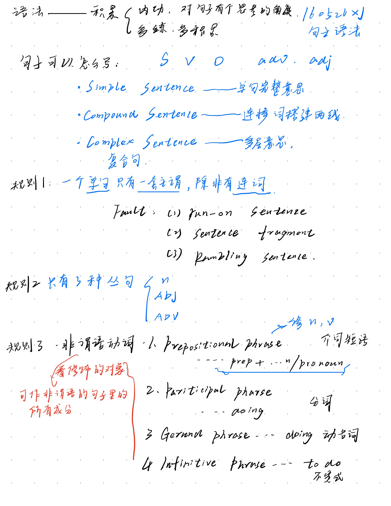

# Grammar

## as ... that of  
记录一下，自己搜，自己学
* 基本结构
"as...that of"结构的基本形式为："as + 形容词/副词 + as + 名词/代词 + that of + 另一名词/代词"。例如：
1. This car is as expensive as that of my neighbor.（这辆车和我邻居的那辆一样贵。）
2. She runs as fast as that of the champion.（她跑得和冠军一样快。）
that : 作关系代词，指代前句，避免重复
