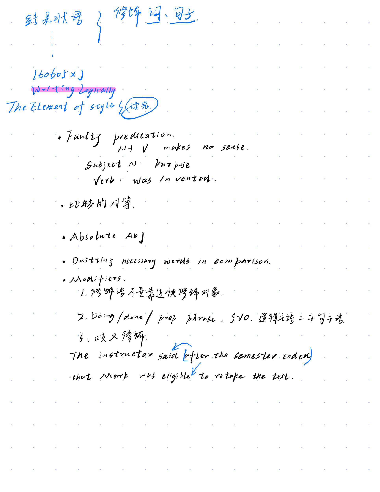
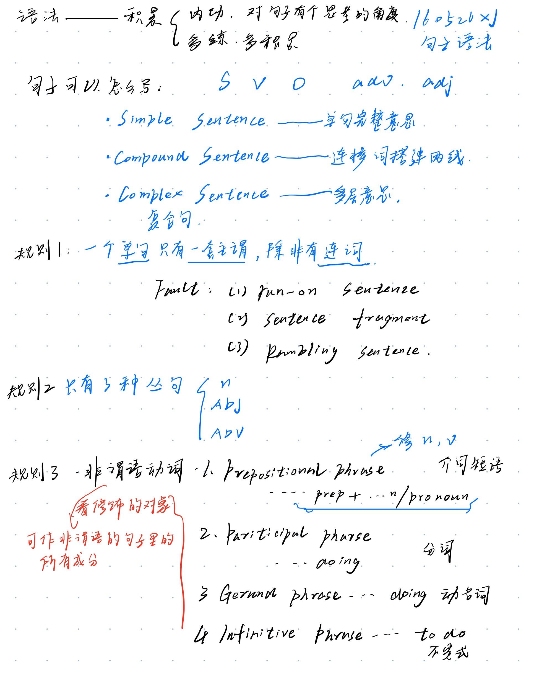

# 句
## Basic Structure

### Style
* [style](https://writingcenter.unc.edu/tips-and-tools/style/)
* 比较句
  * Compare two unequal subject
  * An ambiguous comparision that could be interpreted two different meaning

### Be specific
### Logically
#### Compare
#### 逻辑主语
### 动词名词化  
### 句子长度
### Structure
### Tense
### 介词
### 虚拟语气
### Sentense的修正

### Grammar

* Active voice/Passive voice->Emphasized on what

#### [倒装句](https://www.bilibili.com/video/BV1X54y1h7qR)
* 完全倒装
  * 副词、介词短语在句首的倒装
  * 主语补语(表语)的倒装
* 部分倒装
  * 句首有否定意义词时的倒装
  * 句首有‘only’时的倒装
  * 'if...should...'构成的虚拟语气的倒装
  * 固定句型中的倒装
* 形式倒装
   
#### 从句
* view the subsentence as describe word to the main sentence
1. 一个句子(主句or从句)只能有一套主谓。~~Run-on Sentence~~
   * SVO, SVO
   * SVOVO
   * SVO,VO
 * solute
   * SVO, and SVO
   * SVO, SVO 
   * transform to subparagraph
     * 主，从 ---- **change the emphasis on the topic**
2. 从句意上看，a sentence only include the noun, the verb, the adj, the adv
   * only exist 
     * noun subsentence
     * adj subsentence
     * adv subsentence
3. Phrase --
   1. prep + n/pronoun -----as a adv or adj
   2. Ving / 分词
      V + ing 名词化——表动作的名词
      Prep + Ving ----介词本身的意思 + 动词名词化的意思
      to do ---非谓语动词 ----做谓语以外的所有词

#### as ... that of  
记录一下，自己搜，自己学
* 基本结构
"as...that of"结构的基本形式为："as + 形容词/副词 + as + 名词/代词 + that of + 另一名词/代词"。例如：
1. This car is as expensive as that of my neighbor.（这辆车和我邻居的那辆一样贵。）
2. She runs as fast as that of the champion.（她跑得和冠军一样快。）
that : 作关系代词，指代前句，避免重复
