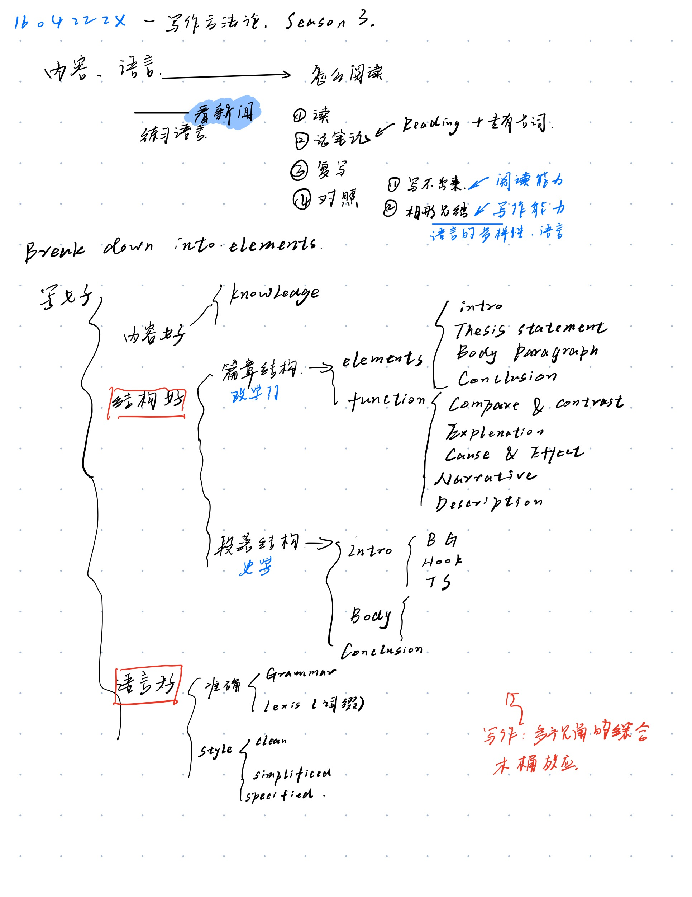
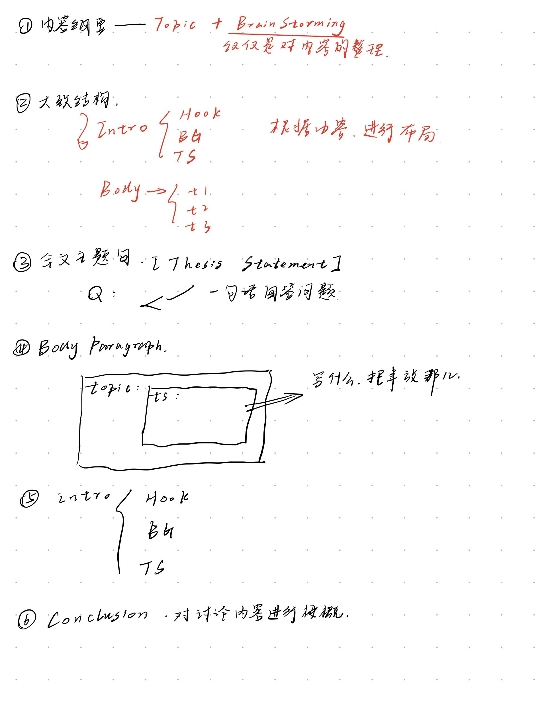
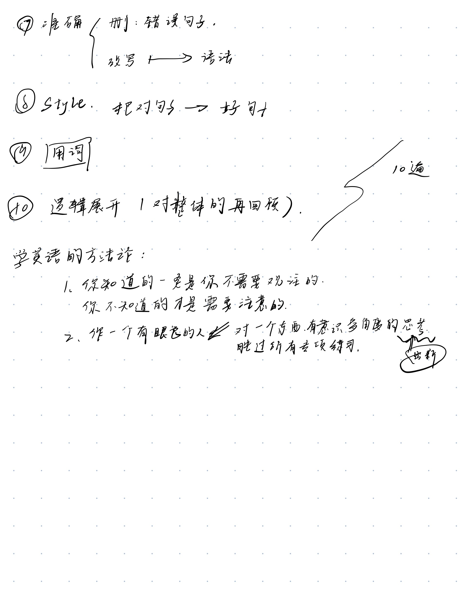

# A Summary of writing of baiyun
------
## Principle for writing
* What -- to write ? -----Content
* Why -- am i writing?
* How --- to write effectively
**Content > Structure > Language**
* Content 
  * Insightful analysis of complex ideas with **persuasive reasoning** and/or **compelling description**
* Structure
  * **Well focused** and **logically organized**
* Language
  * convey meaning precisely and appropriately **by** skillful using sentence variety and vocabulary. Correct sentence structure and language usage and vocabulary. Correct sentence structure and language usage.

# Steps when writing

